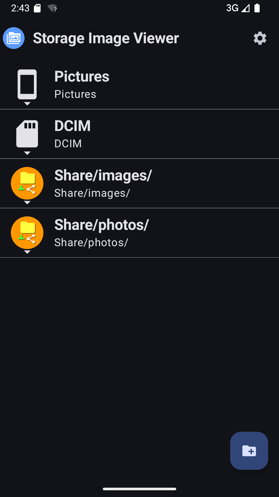
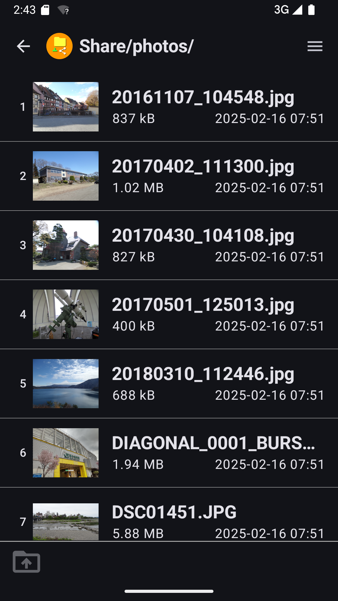

Storage Image Viewer
====================

## About

**Storage Image Viewer** is an Android app to show image files on storage.

 

## Release History (APK Download)

* [Release](https://github.com/wa2c/storage-image-viewer/releases)

## Source Code

* [GitHub](https://github.com/wa2c/storage-image-viewer)

## Licence

Copyright &copy; 2025 wa2c [MIT License](https://github.com/wa2c/storage-image-viewer/blob/master/LICENSE)

## Author

[wa2c](https://github.com/wa2c)
